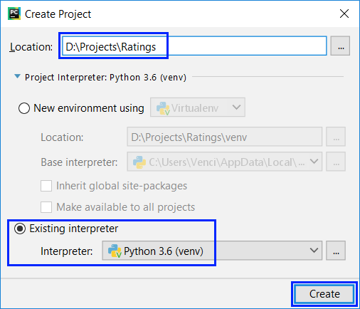
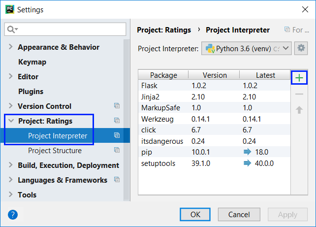
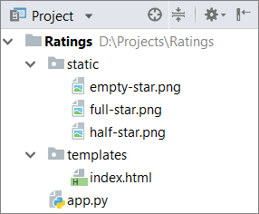
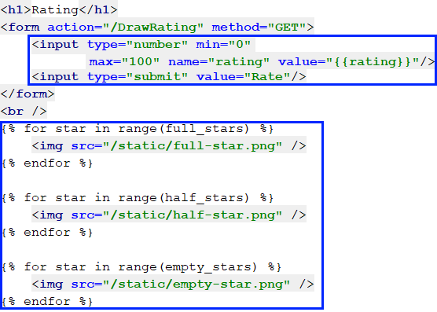
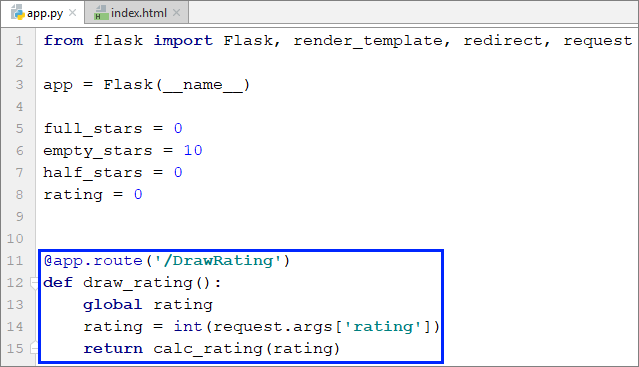

# Chapter 6.1. Nested Loops

In the current chapter, we will be looking at **nested loops** and how to use `for` loops to **draw** various **figures on the console**, that contain symbols and signs, ordered in rows and columns on the console. We will use **single** and **nested loops** (loops that stay in other loops), **calculations** and **checks**, in order to print on the console simple and not so simple figures by specified sizes.


## Video 

<div class="video-player">
  Watch the video lesson of this chapter here: 
  https://www.youtube.com/watch?v=kkxl1bitNAg.
</div>


### Example: Rectangle Made of 10 x 10 Asterisks

Print on the console a rectangle made out of **10 x 10** asterisks.

|Input|Output|
|---|---|
|(None)|<code>\*\*\*\*\*\*\*\*\*\*</code><br><code>\*\*\*\*\*\*\*\*\*\*</code><br><code>\*\*\*\*\*\*\*\*\*\*</code><br><code>\*\*\*\*\*\*\*\*\*\*</code><br><code>\*\*\*\*\*\*\*\*\*\*</code><br><code>\*\*\*\*\*\*\*\*\*\*</code><br><code>\*\*\*\*\*\*\*\*\*\*</code><br><code>\*\*\*\*\*\*\*\*\*\*</code><br><code>\*\*\*\*\*\*\*\*\*\*</code><br><code>\*\*\*\*\*\*\*\*\*\*</code>|

#### Hints and Guidelines


How does the example work? We initialize **a loop with a variable `i`**. The default value of the variable is  **`i = 0`**. With each iteration of the loop, the variable increases by **1** while it is **less than 10**. This way the code in the body of the loop is executed **10 times** - from **0<sup>-th</sup>** to **9<sup>-th</sup>** included. In the body of the loop, we print a new line on the console **`'*' * 10`**, which creates a string of 10 asterisks.


#### Testing in the Judge System

Test your solution here: [https://judge.softuni.org/Contests/Practice/Index/1055#0](https://judge.softuni.org/Contests/Practice/Index/1055#0).


### Example: Rectangle Made of N x N Asterisks

Write a program which receives a positive number **n** and prints on the console **a rectangle made out of N x N asterisks**. 

|Input|Output|Input|Output|Input|Output|
|---|---|---|---|---|---|
|2|<code>\*\*</code><br><code>\*\*</code>|3|<code>\*\*\*</code><br><code>\*\*\*</code><br><code>\*\*\*</code>|4|<code>\*\*\*\*</code><br><code>\*\*\*\*</code><br><code>\*\*\*\*</code><br><code>\*\*\*\*</code>|

#### Hints and Guidelines

The task is similar to the previous one: 


#### Testing in the Judge System

Test your solution here: [https://judge.softuni.org/Contests/Practice/Index/1055#1](https://judge.softuni.org/Contests/Practice/Index/1055#1).


## Nested loops

A **nested loop** is a construction where **the body of one loop** (the outer one) **stays inside another loop** (the inner one). In each iteration of the outer loop, **the whole** inner loop is executed. This happens in the following way:

 - When nested loops start executing, **the outer loop starts** first: **initialization** of its control variable is performed and after checking for end of the loop, the code in its body is executed.
  - After that, **the inner loop is executed**. The control variable's start position is initialized, a check for end of the loop is made and the code in its body is executed.
 - When the set value for **end of the loop** is reached, the program goes back one step up and continues executing the previous outer loop. The control variable of the outer loop changes with one step, a check is made to see if the condition for end of the loop is met and **a new execution of the nested \(inner\) loop is started**.
 - This is repeated until the variable of the outer loop meets the condition to **end the loop**.

Here is an **example** that illustrates nested loops. The aim is again to print a rectangle made of **N x N asterisk**, in which for each row a loop iterates from **1** to **N**, and for each column a nested loop is executed from **1** to **N**:


In **Python**, when the standard initial value of the variable in the loop (**`i = 0`**) does not work for us, we can change it with the above syntax. I.e. when we want the loop to start from **1** and rotate to **`n`** inclusive, we write: **`for i in range (1, n + 1)`**. The first value in parentheses indicates the beginning of the loop, and the second - the end of the loop, but not including, i.e. the loop ends before it is reached. 

Let's look at the example above. After the initialization of the **first (outer) loop**, its **body**, which contains **the second (nested) loop**, starts to run. It itself prints one line **`n`** of asterisks. After the **internal** loop **completes** its execution in the first iteration of the external one, then **the external one will continue**, i.e. will print a blank line on the console. **Then** the **first** loop ** will be **updated** and the whole **second** (nested) loop will be executed again. The inner loop will be executed as many times as the body of the outer loop is executed, in this case **`n`** times. 

### Example: Square Made of Asterisks

Print on the console a square made of **N x N** asterisks:

|Input|Output|Input|Output|Input|Output|
|---|---|---|---|---|---|
|2|<code>\* \*</code><br><code>\* \*</code>|3|<code>\* \* \*</code><br><code>\* \* \*</code><br><code>\* \* \*</code>|4|<code>\* \* \* \*</code><br><code>\* \* \* \*</code><br><code>\* \* \* \*</code><br><code>\* \* \* \*</code>|

#### Hints and Guidelines

The problem is similar to the last one. The difference here is that we need to figure out how to add a whitespace after the asterisks so that there aren't any excess white spaces at the beginning and the end:


#### Тестване в Judge системата

Test your solution here: [https://judge.softuni.org/Contests/Practice/Index/1055#2](https://judge.softuni.org/Contests/Practice/Index/1055#2).

### Example: Triangle Made of Dollars

Write a program which receives an integer **n** and prints **a triangle made of dollars** of size **n**.

|Input|Output|Input|Output|Input|Output
|---|---|---|---|---|---|
|3|<code>&dollar;</code><br><code>&dollar; &dollar;</code><br><code>&dollar; &dollar; &dollar;</code>|4|<code>&dollar;</code><br><code>&dollar; &dollar;</code><br><code>&dollar; &dollar; &dollar;</code><br><code>&dollar; &dollar; &dollar; &dollar;</code>|5|<code>&dollar;</code><br><code>&dollar; &dollar;</code><br><code>&dollar; &dollar; &dollar;</code><br><code>&dollar; &dollar; &dollar; &dollar;</code><br><code>&dollar; &dollar; &dollar; &dollar; &dollar;</code>|

#### Hints and Guidelines

The problem is **similar** to those for drawing **a rectangle** and **square**. Once again, we will use **nested loops**, but there is **a  catch** here. The difference is that **the number of columns** that we need to print depends on **the row**, on which we are and not on the input number **`n`**. From the example input and output data, we see that **the count of dollars depends** on which **row** we are on at the moment of the printing, i.e. 1 dollar means the first row, 3 dollars mean the third row, and so on. Let's see the following example in detail. We see that **the variable** of **the nested** loop is connected with the variable of **the outer** one. This way our program prints the desired triangle:


#### Testing in the Judge System

Test your solution here: [https://judge.softuni.org/Contests/Practice/Index/1055#3](https://judge.softuni.org/Contests/Practice/Index/1055#3).


### Example: Square Frame

Write a program which receives a positive integer **n** and draws on the console **a square frame** with a size of **N x N**.

|Input|Output|Input|Output|
|---|---|---|---|
|3|<code>+ - +</code><br><code>&#124; - &#124;</code><br><code>+ - +</code>|4|<code>+ - - +</code><br><code>&#124; - - &#124;</code><br><code>&#124; - - &#124;</code><br><code>+ - - +</code>|

|Input|Output|Input|Output|
|---|---|---|---|
|5|<code>+ - - - +</code><br><code>&#124; - - - &#124;</code><br><code>&#124; - - - &#124;</code><br><code>&#124; - - - &#124;</code><br><code>+ - - - +</code>|6|<code>+ - - - - +</code><br><code>&#124; - - - - &#124;</code><br><code>&#124; - - - - &#124;</code><br><code>&#124; - - - - &#124;</code><br><code>&#124; - - - - &#124;</code><br><code>+ - - - - +</code>|

#### Hints and Guidelines

We can solve the problem in the following way:
* We read from the console the number **`n`**.
* We print **the upper part**: first a **`+`** sign, then **n-2** times **`-`** and in the end a **`+`** sign.
* We print **the middle part**: we print **n-2** rows, as we first print a **`|`** sign, then **n-2** times **`-`** and in the end again a **`|`** sign. We can do this with nested loops.
* We print **the lower part**: first a **`+`** sign, then **n-2** times **`-`** and in the end a **`+`** sign.

Here is an example implementation of the above idea with nested loops:


#### Testing in the Judge System

Test your solution here: [https://judge.softuni.org/Contests/Practice/Index/1055#4](https://judge.softuni.org/Contests/Practice/Index/1055#4).


### Problem: Rhombus Made of Asterisks

Write a program which receives a positive integer **n** and prints **a rhombus made of asterisks** with size **N**.

|Input|Output|Input|Output|
|---|---|---|---|
|1|<code>\*</code>|2|<code>&nbsp;\*&nbsp;</code><br><code>\*&nbsp;\*</code><br><code>&nbsp;\*&nbsp;</code><br>|


|Input|Output|Input|Output|
|---|---|---|---|
|3|<code>&nbsp;&nbsp;\*&nbsp;&nbsp;</code><br><code>&nbsp;\*&nbsp;\*&nbsp;</code><br><code>\*&nbsp;\*&nbsp;\*</code><br><code>&nbsp;\*&nbsp;\*&nbsp;</code><br><code>&nbsp;&nbsp;\*&nbsp;&nbsp;</code>|4|<code>&nbsp;&nbsp;&nbsp;\*&nbsp;&nbsp;&nbsp;</code><br><code>&nbsp;&nbsp;\*&nbsp;\*&nbsp;&nbsp;</code><br><code>&nbsp;\*&nbsp;\*&nbsp;\*&nbsp;</code><br><code>\*&nbsp;\*&nbsp;\*&nbsp;\*</code><br><code>&nbsp;\*&nbsp;\*&nbsp;\*&nbsp;</code><br><code>&nbsp;&nbsp;\*&nbsp;\*&nbsp;&nbsp;</code><br><code>&nbsp;&nbsp;&nbsp;\*&nbsp;&nbsp;&nbsp;</code>|

#### Hints and Guidelines

To solve this problem, we need to mentally **divide** **the rhombus** into **two parts** – the **upper** one, which **also** includes the middle row, and the **lower** one. For **the printing** of each part, we will use **two** separate loops, as we leave the reader to decide the dependency between **`n`** and the variables of the loops. For the first loop we can use the following guidelines:

* We print **`n-row`** whitespaces.
* We print **`*`**.
* We print **`row-1`** times **`*`**.

**The second** (lower) part will be printed **similarly**, which again we leave to the reader to do.


<table><tr><td></td>
<td>In Python, the standard step of the <strong><code>for</code></strong> loop is positive and is equal to 1. If we want to change it, we must use a third parameter in the arguments of the loop: <code><b>for i in range (0, 100, 2)</b></code>. The third parameter in this case shows that the variable will increase from 0 to 99 inclusive, with step 2.</td>
</tr></table>

#### Testing in the Judge System

Test your solution here: [https://judge.softuni.org/Contests/Practice/Index/1055#5](https://judge.softuni.org/Contests/Practice/Index/1055#5).

### Problem: Christmas Tree

Write a program which receives a number **n** (1 ≤ n ≤ 100) and prints a Christmas tree with a height of **N + 1**.

|Input|Output|Input|Output|
|---|---|---|---|
|1|<code>&nbsp;&nbsp;&#124;&nbsp;&nbsp;</code><br><code>\*&nbsp;&#124;&nbsp;\*</code>|2|<code>&nbsp;&nbsp;&nbsp;&#124;&nbsp;&nbsp;&nbsp;</code><br><code>&nbsp;\*&nbsp;&#124;&nbsp;\*&nbsp;</code><br><code>\*\*&nbsp;&#124;&nbsp;\*\*</code>|

|Input|Output|Input|Output|
|---|---|---|---|
|3|<code>&nbsp;&nbsp;&nbsp;&nbsp;&#124;&nbsp;&nbsp;&nbsp;&nbsp;</code><br><code>&nbsp;&nbsp;\*&nbsp;&#124;&nbsp;\*&nbsp;&nbsp;</code><br><code>&nbsp;\*\*&nbsp;&#124;&nbsp;\*\*&nbsp;</code><br><code>\*\*\*&nbsp;&#124;&nbsp;\*\*\*</code>|4|<code>&nbsp;&nbsp;&nbsp;&nbsp;&nbsp;&#124;&nbsp;&nbsp;&nbsp;&nbsp;&nbsp;</code><br><code>&nbsp;&nbsp;&nbsp;\*&nbsp;&#124;&nbsp;\*&nbsp;&nbsp;&nbsp;</code><br><code>&nbsp;&nbsp;\*\*&nbsp;&#124;&nbsp;\*\*&nbsp;&nbsp;</code><br><code>&nbsp;\*\*\*&nbsp;&#124;&nbsp;\*\*\*&nbsp;</code><br><code>\*\*\*\*&nbsp;&#124;&nbsp;\*\*\*\*</code>|

#### Hints and Guidelines

From the examples, we see that **the Christmas tree** can be **divided** into **three** logical parts. **The first** part is **the asterisks and the whitespaces before and after them**, **the middle** part is **` | `**, and **the last** part is again **asterisks**, but this time there are **whitespaces** only **before** them. The printing can be done with only **one loop** and the operation **string multiplication** , which we will use once for the asterisks and once for the whitespaces:


#### Testing in the Judge System

Test your solution here: [https://judge.softuni.org/Contests/Practice/Index/1055#6](https://judge.softuni.org/Contests/Practice/Index/1055#6).


## Drawing more complex figures

Let's look at how to **draw figures** using **nested loops** with more complex logic, for which we need to think more before coding.

### Problem: Sunglasses

Write a program which receives an integer **n** (3 ≤ n ≤ 100) and prints sunglasses with a size of **5\*N x N** as found in the examples:

|Input|Output|Input|Output|
|---|---|---|---|
|3|<code>\*\*\*\*\*\*&nbsp;&nbsp;&nbsp;\*\*\*\*\*\*</code><br><code>\*////\*&#124;&#124;&#124;\*////\*</code><br><code>\*\*\*\*\*\*&nbsp;&nbsp;&nbsp;\*\*\*\*\*\*</code>|4|<code>\*\*\*\*\*\*\*\*&nbsp;&nbsp;&nbsp;&nbsp;\*\*\*\*\*\*\*\*</code><br><code>\*//////\*&#124;&#124;&#124;&#124;\*//////\*</code><br><code>\*//////\*&nbsp;&nbsp;&nbsp;&nbsp;\*//////\*</code><br><code>\*\*\*\*\*\*\*\*&nbsp;&nbsp;&nbsp;&nbsp;\*\*\*\*\*\*\*\*</code><br>|

|Input|Output|
|---|---|
|5|<code>\*\*\*\*\*\*\*\*\*\*&nbsp;&nbsp;&nbsp;&nbsp;&nbsp;\*\*\*\*\*\*\*\*\*\*</code><br><code>\*////////\*&nbsp;&nbsp;&nbsp;&nbsp;&nbsp;\*////////\*</code><br><code>\*////////\*&#124;&#124;&#124;&#124;&#124;\*////////\*</code><br><code>\*////////\*&nbsp;&nbsp;&nbsp;&nbsp;&nbsp;\*////////\*</code><br><code>\*\*\*\*\*\*\*\*\*\*&nbsp;&nbsp;&nbsp;&nbsp;&nbsp;\*\*\*\*\*\*\*\*\*\*</code><br>|

#### Hints and Guidelines

From the examples, we can see that the sunglasses can be divided into **three parts** – upper, middle, and lower. Below is part of the code with which the problem can be solved. When drawing the upper and lower rows we need to print **`2 * n`** asterisks, **`n`** whitespaces, and **`2 * n`** asterisks:


When drawing **the middle** part, we need to **check** if the row is **`(n-1) / 2 - 1`**, because in the examples we can see that in **this row** we need to print **vertical slashes** instead of whitespaces:


#### Testing in the Judge System

Test your solution here: [https://judge.softuni.org/Contests/Practice/Index/1055#7](https://judge.softuni.org/Contests/Practice/Index/1055#7).

### Problem: House

Write a program which receives a number **n** (2 ≤ **n** ≤ 100) and prints **a house** with size **N x N**, just as in the examples:

|Input|Output|Input|Output|Input|Output|
|---|---|---|---|---|---|
|2|<code>**</code><br><code>&#124;&#124;</code><br>|3|<code>-\*-</code><br><code>\*\*\*</code><br><code>&#124;\*&#124;</code>|4|<code>-\*\*-</code><br><code>\*\*\*\*</code><br><code>&#124;\*\*&#124;</code><br><code>&#124;\*\*&#124;</code>

|Input|Output|Input|Output|
|---|---|---|---|
|5|<code>--\*--</code><br><code>-\*\*\*-</code><br><code>\*\*\*\*\*</code><br><code>&#124;\*\*\*&#124;</code><br><code>&#124;\*\*\*&#124;</code>|8|<code>---\*\*---</code><br><code>--\*\*\*\*--</code><br><code>-\*\*\*\*\*\*-</code><br><code>\*\*\*\*\*\*\*\*</code><br><code>&#124;\*\*\*\*\*\*&#124;</code><br><code>&#124;\*\*\*\*\*\*&#124;</code><br><code>&#124;\*\*\*\*\*\*&#124;</code><br><code>&#124;\*\*\*\*\*\*&#124;</code><br>|


#### Hints and Guidelines

We understand from the description of the problem that the house is with a size of **`n` x `n`**. What we see from the example input and output is that:

* The house is divided into two parts: **roof and base**.


* When **`n`** is an even number, the point of the house is "dull".
* When **`n`** is odd, **the roof** has a sharp point and is one row larger than the **base**.

##### The Roof
* It comprises **asterisks** and **dashes**.
* At its highest part there are one or two asterisks, depending on whether **n** is even or odd, as well as dashes. 
* At its lowest part, there are many asterisks and little to no dashes.
* With each lower row, **the asterisks** increase by 2, and **the dashes** decrease also by 2.


##### The Base
* The height is **`n`** rows.
* It is made out of **asterisks** and **vertical slashes**.
* Each row comprises 2 **vertical slashes** – one in the beginning and one at the end of the row, and also **asterisks** between the vertival slashes with a string length of **`n - 2`**.    

We read the input number **`n`** from the console and write its value in a variable: 


<table><tr><td></td>
<td><b>It is very important to check if the input data is correct!</b> In these tasks, it is not a problem to directly convert the data from the console into type <b><code>int</code></b>, because it is said that we will be given valid integers. If you are making more complex programs, it is a good practice to check the data. What will happen if instead of a number the user inputs the character "A"?</td>
</tr></table>

To draw **the roof**, we write down how many **asterisks** we start with a variable called **`stars`**:
* If **`n`** is an **odd** number, there will be 1 star.
* If it is **even**, there will be 2.


Calculate the length of **the roof**. It equals half of **`n`**. Write the result in the variable **`roof_length`**:


**Note:** To use **`math.ceil ()`**, which rounds to the larger integer, regardless of the fractional part, it is necessary to import the library **`math`**. This is done with the command **`import math`**. It is recommended to write **`import math`** (as well as all other imports) at the beginning of the file. 

It is important to note that when **`n`** is an odd number, the length of the roof is one row more than that of the **base**.

In **Python**, when two integer types are divisible and there is a remainder, the result will be a number with a remainder. If we want to perform a pure integer division without a remainder, it is necessary to use the operator **`//`**. 

Example:

```python
result1 = 3 / 2    # result 1.5
result2 = 3 // 2   # result 1
```

If we want to round up to the next largest integer number, we need to use the method **`math.cail(…)`**:
**`result = math.ceil(3 / 2)`**.

After we have calculated the length of the roof, we make a loop from 0 to **`roof_length`**. On each iteration we will:
* Calculate the number of **dashes** we need to draw. The number will be equal to **`(n - stars) / 2`**. We store it in variable **`padding`**.


* We print on the console: "**dashes**" (**`padding`** times) + "**asterisks**" (**`stars`** times) + "**dashes**" (**`padding`** times):


* Before the iteration is over, we add 2 to **`stars`** (the number of **the asterisks**).


After we have finished with the **roof**, it is time for **the base**. It is easier to print:
* We start with a loop from 0 to `n` (exclusive).
* We print on the console: `|` + `*` (**`n - 2`** times) + `|`.


If we have written everything correctly, our problem should be solved. 

#### Testing in the Judge System

Test your solution here: [https://judge.softuni.org/Contests/Practice/Index/1055#8](https://judge.softuni.org/Contests/Practice/Index/1055#8).

### Example: Diamond

Write a program which receives an integer **n** (1 ≤ **n** ≤ 100) and prints a diamond with size **N**, as in the following examples:

|Input|Output|Input|Output|Input|Output|
|---|---|---|---|---|---|
|1|<code>\*</code><br>|2|<code>\*\*</code>|3|<code>-\*-</code><br><code>\*-\*</code><br><code>-\*-</code>|

|Input|Output|Input|Output|Input|Output|
|---|---|---|---|---|---|
|4|<code>-\*\*-</code><br><code>\*--\*</code><br><code>-\*\*-</code>|5|<code>--\*--</code><br><code>-\*-\*-</code><br><code>\*---\*</code><br><code>-\*-\*-</code><br><code>--\*--</code><br>|6|<code>--\*\*--</code><br><code>-\*--\*-</code><br><code>\*----\*</code><br><code>-\*--\*-</code><br><code>--\*\*--</code><br>|

|Input|Output|Input|Output|Input|Output|
|---|---|---|---|---|---|
|7|<code>---\*---</code><br><code>--\*-\*--</code><br><code>-\*---\*-</code><br><code>\*-----\*</code><br><code>-\*---\*-</code><br><code>--\*-\*--</code><br><code>---\*---</code><br>|8|<code>---\*\*---</code><br><code>--\*--\*--</code><br><code>-\*----\*-</code><br><code>\*------\*</code><br><code>-\*----\*-</code><br><code>--\*--\*--</code><br><code>---\*\*---</code><br>|9|<code>----\*----</code><br><code>---\*-\*---</code><br><code>--\*---\*--</code><br><code>-\*-----\*-</code><br><code>\*-------\*</code><br><code>-\*-----\*-</code><br><code>--\*---\*--</code><br><code>---\*-\*---</code><br><code>----\*----</code>|

#### Hints and Guidelines

What we know from the problem's description is that the diamond is **`n` x `n`** in size. From the example input and output we can conclude that all rows contain exactly **`n`** symbols, and all the rows, except for the top and bottom ones, have **2 asterisks**. We can mentally divide the diamond into 2 parts:
* **Upper** part. It starts from the upper tip down to the middle.
* **Lower** part. It starts from the row below the middle one and goes down to the lower tip (inclusive).

##### Upper Part

* If **n** is an **odd** number, it starts with **1 asterisk**.
* If **n** is an **even** number, it starts with **2 asterisks**.
* With each row down, the asterisks get further away from each other.
* The space between, before, and after **the asterisks** is filled up with **dashes**.

##### Lower Part

* With each row down, the asterisks get closer to each other. This means that space (**the dashes**) between them is getting smaller and space (**the dashes**) on the left and the right is getting larger.
* The bottom-most part has 1 or 2 **asterisks**, depending on whether **n** is an even or odd number.

##### Upper and Lower Parts of the Diamond

* On each row, except the middle one, the asterisks are surrounded by inner and outer **dashes**.
* On each row, there is space between the two **asterisks**, except on the first and the last row (sometimes **the asterisk is 1**).

We read the value of **`n`** from the console, converting it to type **`int`**: 


We start drawing the upper part of the diamond. The first thing we need to do is to calculate the number of the outer **dashes `left_right`** (the dashes on the outer side of **the asterisks**). It is equal to **`(n - 1) / 2`**, rounded down:


After we have calculated **`left_right`**, we start drawing **the upper part** of the diamond. We can start by running a **loop** from **`(n + 1) // 2`** (i.e. rounded down).

At each iteration of the loop the following steps must be taken:

* We print on the console the left **dashes** (with length **`left_right`**) and right after them the first **asterisk**:


* We will calculate the distance between the two **asterisks**. We can do this by subtracting from **n** the number of the outer **dashes**, and the number 2 (the number of **the asterisks**, i.e. the diamond's outline). We need to store the result of the subtraction in a variable **`mid`**. 


* If the **`mid`** is lower than 0, we know that on the row there should be only 1 star. If it is higher or equal to 0 then we have to print **dashes** with length **`mid`** and one **asterisk** after them.

* We print on the console the right outer **dashes** with length **`left_right`**. 


* At the end of the loop, we decrease **`left_right`** by 1 (**the asterisks** are moving away from each other).

We are ready with the upper part.

Printing the lower part is very similar to that of the upper part. The difference is that instead of decreasing **`left_right`** with 1 at the end of the loop, we will increase it with 1 at the beginning of the loop. Also, **the loop will iterate from 0 to `(n - 1) // 2`**:


<td><b>Repeating a code is considered bad practice</b> because the code becomes very hard to maintain. Let's imagine that we have a piece of code (e.g. the logic for drawing a row from the diamond) in a few more places and we decide to change it. In order to do this, we will have to go through all the places and change it everywhere. Now let's imagine that you need to reuse a piece of code not 1, 2, or 3 times but tens of times. A way to overcome this problem is to use <b>functions</b>. You can search for more information about them on the Internet or view <a href="chapter-10-functions.md">Chapter “10” (Functions)</a>.</td>
</tr></table>

If we have written all correctly, then the problem is solved.

#### Testing in the Judge System

Test your solution here: [https://judge.softuni.org/Contests/Practice/Index/1055#9](https://judge.softuni.org/Contests/Practice/Index/1055#9).


## What did you learn from this chapter?

We learned about one of the ways to create strings: 

```python
print_me = '*' * 5
```

We learned how to draw figures using nested **`for`** loops:

```python
for row in range(5):
    print('*', end='')

    for col in range(4):
        print(' *', end='')

    print()
```

## Lab: Drawing Figures in a Web Environment 

Now that we got used to **nested loops** and the way to use them to draw figures on the console, we can get into something even more interesting: we can see how loops can be used to **draw in a Web environment**. We will make a web application that visualizes a number rating (a number from 0 to 100) with stars. This kind of visualization is common in e-commerce sites, reviews of products, event rating, rating of apps, and others.

Don't worry if you don't understand all of the code, how exactly it is written and how the project works. It is normal, now we are learning to write code and we are a long way from the web development technologies. If you are struggling to write your project by following the steps, ask for help in the SoftUni official **discussion forum**: https://softuni.bg/forum.

### Problem: Ratings – Visualization in a Web Environment

Develop a web application for rating visualization (number from 0 to 100). Draw from 1 to 10 stars (with halves). Stars to be generated with a **`for`** cycle. 


#### Hints and Guidelines

We start by creating a new project in **PyCharm** from [**File**] -> [**New Project**] (or from the start window): 


We give a meaningful name to the project, for example "Ratings". We choose the type of the current **Python interpreter**. Let this be the default:



We will again use the Flask library, which is used to create web applications. Before we can start coding, we need to install Flask. Let's recall how to do this. We go to the settings of PyCharm [**File**] -> [**Settings**] -> [**Project: Ratings**] -> [**Project Interpreter**]. There, we press the **`+`** button: 



Look for **Flask** in the window that appears and click the [**Install Package**] button: 


We are now adding the **structure** of the project (the assignment files for this project can be downloaded from [here](https://github.com/SoftUni/Programming-Basics-Book-Python-BG/tree/chapter-06-nested-loops/assets/chapter-6-1-assets)). Copy them from Windows Explorer and paste them in the **Ratings** project folder with Copy/Paste: 



For everything to work, we need to add the code. First we go to the file **index.html** (from the templates folder) and look for the **TODO** sections. In their place we enter the following code:


The above code creates a web form **`<form>`** with one field **`" rating "`** for entering a number in the interval [**0… 100**] and a button [**Rate**] to send the data from the form to the server. Then, draw with three separate **for** loops the corresponding number of stars - filled, half-empty and empty. 

The action that will process the data is called **`/DrawRatings`**, which means the function **`draw_ratings ()`** in the file **`app.py`**: 



The code from the function **`draw_ratings ()`** takes the entered number **`rating`** from the form and passes it to the function **`calc_rating (…)`**. The **`calc_rating (…)`** function computes and calculates the number of **full stars**, the number of **empty stars** and the number of **halves of stars**, then reloads the page, but with new ones submitted values of the variables for the stars. We implement it as follows:


We start the project with [**Ctrl+Shift+F10**] (or with [**Right button**] -> [**Run 'app'**]) and wait for it to load: 


We go to the specified address and enjoy the finished project: 


If you have problems with the sample project above, you can ask questions in the **SoftUni forum**:  [https://softuni.bg/forum](https://softuni.bg/forum).
